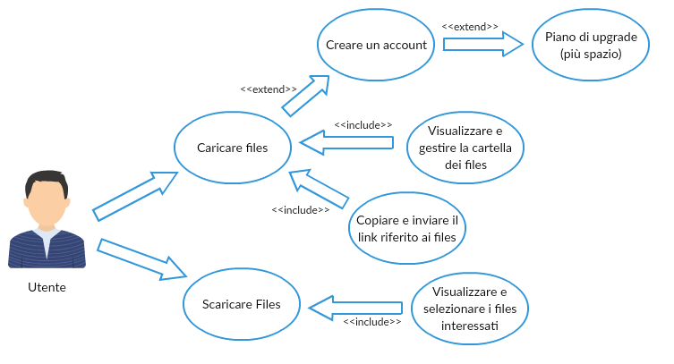

# Link Box - Software Requirements Specification

## 1. Introduzione

### 1.1 Proposito
Questo SRS descrive tutte le specifiche per *Link Box*. Si tratta di un'applicazione web facile e ottimizzata per l'uso su ogni dispositivo.
*Link Box* consente agli utenti di caricare i propri file sul cloud e inviarli a chiunque tramite un link. Questi file verranno immdiatamente inviati e memorizzati su un server sicuro.  In questo documento il sito web verrà spiegato maggiormente soffermandosi sui punti più importanti che rendono il servizio efficente e comodo da utilizzare. Si discuterà quindi dell'affidabilità, della velocità di reazione ed altri aspetti interessanti. Verranno spiegate anche le carratteristiche specifiche che includono la progettazionee e le decisioni prese relative all'ottimizzazione. Vi è la possibilità di rendere il progetto più vasto aggiungendo funzionalità utili agli utenti.

### 1.2 Scopo
Questa specifica del software si applica all'intera applicazione *Link Box*. L'applicazione è composta da due parti: la prima parte è l'*Upload*, che consente agli utenti di caricare i propri file da computer o smartphone. Questi file vengono salvati in una cartella privata all'interno del Server. La seconda parte è il *Download*, che consente agli utenti di scaricare i file correlati al link.

### 1.3 Definizioni, acronimi e abbreviazioni
In questa sezione sono elencate le definizioni e le spiegazioni degli acronimi e delle abbreviazioni per aiutare il lettore.

- **Cloud** : Spazio di archiviazione personale accessibile in qualsiasi momento ed in ogni luogo utilizzando semplicemente una connessione ad Internet. 
- **Drop Zone** : Apposita finestra in un sito dove poter caricare file semplicemente trascinandoli.

### 1.4 Panoramica
I seguenti capitoli riguardano la mia visione e prospettiva, i requisiti del software, le licenze e la realizzazione tecnica di questo progetto.

## 2. Descrizione Generale

### 2.1 Vista
Capita molto spesso di partecipare a feste di compleanno, visitare nuovi posti o partecipare ad eventi importanti (Matrimonio, Comunione...). Alla fine di essi sicuramente avrete scattato parecchie foto e vi chiederete come sia possibile inviarle a tutti senza utilizzare la vostra connessione o senza passare delle ore a condividere le foto giuste.
Questo progetto è nato per poter inviare foto e video in modo **semplice** e **veloce**. La mia applicazione si adatta per comodità a qualsiasi tipo di file, in caso ci siano formati particolari o documenti digitali.

> La velocità è la forma di estasi che la rivoluzione tecnologica ha regalato all’uomo - [Milan Kundera]

Le persone che utilizzano questa applicazione web possono caricare qualsiasi tipo di file in uno spazio dedicato sul server. Lì sono memorizzati in una cartella privata accessibile solo al proprietario.

La seguente figura mostra il diagramma generale dei casi d'uso del software finale che vorrei raggiungere :

## 3. Requisiti specifici - Application Web

### 3.1 Funzionalità presenti

#### 3.1.1 Upload Page
Nella pagina di caricamento c'è la possibilità di caricare file tramite un bottone o grazie alla *Drop Zone*. Successivamente si potranno aggiungere o togliere i file prima che vengano caricati sul server. Se il download viene interrotto vengono salvati solamente i file che il sito è riuscito a caricare. Durante l'attesa del caricamento verrà mostrata a video una barra con relativa percentuale. Finito l'upload dei file verrà generato un link utilizzabile per poter scaricare i file.

#### 3.1.2 Download file
Nella pagina del download viene mostrata la lista dei file da scaricare correlati al link. Al click del pulsante i file vengono compressi in uno zip e scaricati in locale.
È possibile fare un test del download inserendo questo link http://localhost/Tesina/iUbfSJV.

### 3.2 Funzionalità aggiuntive

#### 3.2.1 Registrazione e Login
Nella home page del sito web c'è la possibilità di registrarsi. Una registrazione approvata verificando l'indirizzo e-mail dell'utente.
Inoltre il sito Web contiene una pagina di accesso per gli utenti che hanno già effettuato la registrazione per un account.

#### 3.2.2 Profilo
Questa pagina consente all'utente di visualizzare e modificare il proprio profilo. Un profilo semplice che permette anche all'utente di fare un piano di upgrade per ampliare le funzionalità del servizio.

### 3.3 Utilizzo

#### 3.3.1 Utenti con Smartphone o Computer
L'utilizzo su entrambi i dispositivi è esattamente lo stesso. Il sito è responsive quindi si adatta allo schermo senza così rovinare il layout. Essendo un Application Web è possibile usufruire del servizio semplicemente avendo un Browser installato sul dispositivo e una connesione ad Internet.

### 3.4 Progettazione
Nei seguenti sottocapitoli puoi leggere la progettazione software ed alcune importanti decisioni generali.

#### 3.4.1 Back-end in PHP
Nel back-end risiedono le parti di codice scritte in PHP che permettono all'Application Web di poter caricare i file in una cartella durante l'upload e di poterli scaricare durante la fase di download. Per il caricamento dei file ho utilizzato AJAX che permette lo scambio di dati in background fra web browser e server. Tramite l'API XMLHttpRequest è possibile passare un vettore da JavaScript ad una pagina PHP in maniera asincrona, cioè evitando che il browser effettui l'aggiornamento della pagina.

#### 3.4.2 Front-end in HTML, CSS e JavaScript
L'intera applicazione è costruita con un design intuitivo, quindi non ci dovrebbe essere la necessità per l'utente di chiedere informazioni o aiuto. L'Application Web è scritta in HTML con puro CSS per la formattazione della pagina. Inoltre ho utilizzato JavaScript per poter interagire con la pagina dinamicamente senza che essa si aggiorni continuamente.

### 3.5 GitHub
Per lo sviluppo del mio sito ho utilizzato una piattaforma open source *GitHub* (nata per ospitare progetti software). GitHub offre piani hosting sia a pagamento (per i progetti software privati) sia gratuiti (per i progetti software open source). Git non è altro che un software di controllo di versione, ciò vuol dire che controlla e gestisce gli aggiornamenti di un progetto senza sovrascrivere nessuna parte del progetto stesso.

### 3.5.1 Commits
| Summary - Description | Date |
|---------------------------------------------------|---------------|
| Layout - Simple responsive layout | 31.03.2018 |
| Upload - Upload with PHP + file ZIP in local directory. Without js for "open file dialog box" | 01.04.2018 |
| Choose & Drop Files - Function js to show the selected files | 01.04.2018 |
| Form Layout - Responsive form. Without Drop Zone upload file | 01.04.2018 |
| Fixed Some Bugs - Fixed layout bugs | 01.04.2018 |
| Fixed Text Area | 01.04.2018 |
| Layout message | 07.05.2018 |
| Dropzone upload (ondrop) | 13.05.2018 |
| Append to formData | 13.05.2018 |
| Upload files | 14.05.2018 |
| Add img to delete file from list | 14.05.2018 |
| Layout list of files | 15.05.2018 |
| Add onclick - deleteFile function not work | 15.05.2018 |
| Delete file from uploads and formData | 16.05.2018 |
| Check if formData is empty | 16.05.2018 |
| Progress Bar during Upload | 16.05.2018 |
| Show Files with Folder name | 25.05.2018 |
| 404 Page - Without the right URL | 27.05.2018 |
| 404 Page Right URL | 27.05.2018 |
| Form and PHP download  - Without correct name folder in PHP | 30.05.2018 |
| Download Completed | 06.06.2018 |
| Revert "Download Completed" - This reverts commit 637d2a1. | 06.06.2018 |
| Download Completed | 06.06.2018 |
| Visible Link - Without "copy link" button | 06.06.2018 |
| Copyable Link | 06.06.2018 |
| Add Use Cases | 18.06.2018 |

### 3.6 Requisito di licenza
Viene utilizzato Apache come interprete PHP con le seguenti impostazioni nel file *php.ini*:
- file_uploads = On (per abilitare l'upload dei file)
- upload_max_filesize = 8000M (limite massimo peso di un file)
- max_file_uploads = 100 (limite file caricabili)
- post_max_size = 8000M (limite massimo di carico da caricare)

Il server è soggetto quindi alla *Apache License 2.0*.

*Arrivare alla fine di un percorso non significa dimenticarsi della strada fatta insieme. Grazie a tutti i professori, alla mia famiglia e agli amici per avermi guidato fino a qui*
